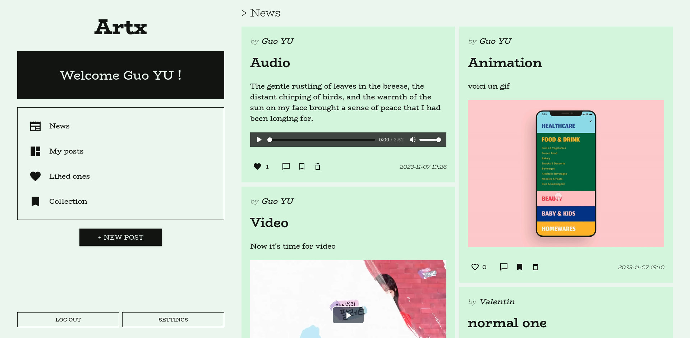

<center>
  
</center>

Deployed web client : https://artx.vercel.app

# Project Description

A social media application that allows users to share images, videos, and music. Key features include a news feed, comments, social interactions (likes and saves), secure authentication via Google or email, media and data storage on cloud services like B2 Cloud Storage and Google Cloud Platform. The application aims to promote creativity, social connectivity, and multimedia exploration within its user community.

# Project Setup

Before launching the server, in the server folder, create and fill up a .env file following the .env.example file as example in that folder.

To launch the server (default port is 3001) :

```bash
cd server/
npm install
(npx) prisma generate
(npx) prisma migrate dev --name init
npm run dev
```

To launch the client (default port is 3000) :

```bash
cd client/
npm install
npm run dev
```
